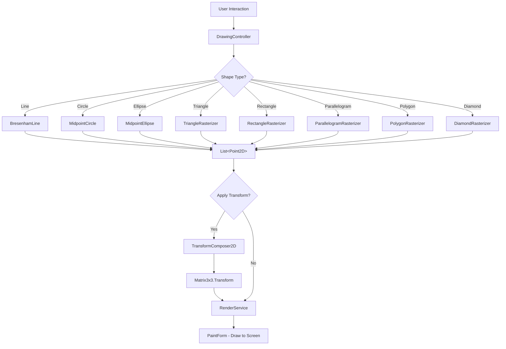

# Luồng Hoạt Động của Project - Computer Graphics Paint

## 1. Tổng Quan
Project **Project_CG_Paint** là ứng dụng đồ họa 2D/3D được xây dựng bằng **C# .NET Framework 4.8** với **Windows Forms**.
Mục tiêu: tạo ra các cảnh (Scene) đồ họa, vẽ các hình 2D/3D bằng thuật toán rasterization, áp dụng biến đổi (Transform), và render lên giao diện.

## 2. Cấu Trúc Project
```
Project_CG_Paint/
├── Algorithms/               # Các thuật toán đồ họa
│   ├── Projection/           # Phép chiếu 3D -> 2D (Cabinet, Cavalier)
│   ├── Rasterization/
│   │   ├── Shape2D/          # Vẽ & tô màu hình 2D (8 files)
│   │   └── Shape3D/          # Wireframe 3D (5 files)
│   └── Transform/            # Ma trận biến đổi (2D & 3D)
├── CoreModel/                # Lõi dữ liệu
│   ├── Geometry/             # BoundingBox, Edge
│   └── Model/                # Point2D, Point3D, Matrix3x3, Matrix4x4, MatrixFactory
├── Data/                     # Dữ liệu đối tượng & scene
│   ├── Objects/              # GraphicObject
│   └── Scene/                # Scene
├── Controllers/              # Điều khiển
│   └── Drawing/              # DrawingController
├── Forms/                    # Giao diện Windows Forms
│   ├── Paint/                # PaintForm - form vẽ chính
│   ├── Transform/            # TransformForm - form biến đổi
│   └── Animation/            # AnimationForm - form hoạt hình
└── Rendering/                # RenderService
```

## 3. Luồng Hoạt Động Chi Tiết

### 3.1. Khởi Tạo
```
Program.cs
  └─> PaintForm (form chính)
        ├─> Khởi tạo Scene (danh sách GraphicObject)
        └─> Khởi tạo DrawingController
```

### 3.2. Vẽ Hình 2D (Rasterization)
Khi người dùng chọn vẽ hình, luồng xử lý:
```
User chọn hình -> DrawingController
  └─> Shape2D Rasterizer tương ứng
        ├─> BresenhamLine     → vẽ đoạn thẳng
        ├─> MidpointCircle    → vẽ đường tròn
        ├─> MidpointEllipse   → vẽ ellipse
        ├─> TriangleRasterizer → vẽ & tô tam giác
        ├─> RectangleRasterizer → vẽ & tô chữ nhật
        ├─> ParallelogramRasterizer → vẽ & tô hình bình hành
        ├─> PolygonRasterizer → vẽ & tô đa giác
        └─> DiamondRasterizer → vẽ & tô hình thoi
  └─> Trả về List<Point2D> các pixel cần hiển thị
```

### 3.3. Biến Đổi 2D (Transform)
```
TransformForm
  └─> TransformComposer2D
        ├─> BuildTranslationByOffset()  → Tịnh tiến
        ├─> BuildScaleByPoint()         → Co giãn (quanh tâm)
        ├─> BuildRotationByPoint()      → Xoay (quanh tâm)
        ├─> BuildReflectionByPoint()    → Đối xứng qua điểm
        └─> BuildReflectionByLine()     → Đối xứng qua đường thẳng
  └─> Matrix3x3.Transform(points) → áp dụng lên danh sách điểm
```

### 3.4. Vật Thể 3D (Wireframe)
```
Shape3D Rasterizer → List<Point3D> → Projection → List<Point2D> → Render
  ├─> CubeWireFrame
  ├─> CylinderWireFrame
  ├─> PrismWireFrame
  ├─> PyramidWireFrame
  └─> SphereWireFrame
```

### 3.5. Render
```
RenderService
  ├─> Nhận List<Point2D> từ Rasterizer
  ├─> Áp dụng Transform (nếu có)
  └─> Vẽ lên Graphics (Windows Forms)
```

## 4. Chi Tiết Các Thuật Toán Shape2D

### 4.1. BresenhamLine
- **Input**: start (Point2D), end (Point2D)
- **Output**: List<Point2D> — các điểm trên đoạn thẳng
- **Nguyên lý**: Thuật toán Bresenham dùng số nguyên, quyết định điểm tiếp theo dựa trên biến `err = dx + dy`, chỉ dùng cộng/trừ — **không dùng phép nhân/chia hay floating-point**.

### 4.2. MidpointCircle
- **Input**: center (Point2D), radius (double)
- **Output**: List<Point2D> — 8 điểm đối xứng cho mỗi bước
- **Nguyên lý**: Xuất phát từ (0, R), dùng tham số quyết định `p`, lợi dụng tính đối xứng 8 phần của đường tròn.

### 4.3. MidpointEllipse
- **Input**: center (Point2D), radiusX (double), radiusY (double)
- **Output**: List<Point2D> — 4 điểm đối xứng cho mỗi bước
- **Nguyên lý**: Chia làm 2 vùng (Region 1 & 2) dựa trên độ dốc, mỗi vùng có tham số quyết định riêng (`p1`, `p2`).

### 4.4. TriangleRasterizer
- **Input**: 3 đỉnh vertex1, vertex2, vertex3
- **Output**: List<Point2D> — cạnh + bên trong
- **Phương pháp**: 
  1. Vẽ 3 cạnh bằng BresenhamLine
  2. Tô bên trong bằng **Scanline Fill**: sắp xếp đỉnh theo Y, với mỗi dòng scanline, tính giao điểm X với 3 cạnh, tô từ xStart → xEnd.

### 4.5. RectangleRasterizer
- **Input**: topLeft (Point2D), bottomRight (Point2D)
- **Output**: List<Point2D> — 4 cạnh + bên trong
- **Phương pháp**: 
  1. Tính 4 đỉnh, vẽ 4 cạnh bằng Bresenham
  2. Duyệt từ (xMin, yMin) → (xMax, yMax) tô toàn bộ pixel.

### 4.6. ParallelogramRasterizer
- **Input**: vertexA, vertexB, vertexC (3 đỉnh, đỉnh D = B + C - A)
- **Output**: List<Point2D> — 4 cạnh + bên trong
- **Phương pháp**: Chia thành 2 tam giác ABC + ACD → gọi TriangleRasterizer.

### 4.7. PolygonRasterizer
- **Input**: List<Point2D> vertices (>= 3 đỉnh, thứ tự theo chiều)
- **Output**: List<Point2D> — các cạnh + bên trong
- **Phương pháp**: Scanline Fill cho đa giác: với mỗi scanline y, tìm giao điểm với tất cả cạnh (loại bỏ giao điểm trùng ở đỉnh), sort, tô từng cặp (i, i+1).

### 4.8. DiamondRasterizer
- **Input**: center (Point2D), radiusX (double), radiusY (double)
- **Output**: List<Point2D> — 4 cạnh + bên trong
- **Phương pháp**: Tính 4 đỉnh (top, right, bottom, left), chia thành 2 tam giác.

## 5. Biểu Đồ Luồng (Flow Diagram)



## 6. Hướng Phát Triển Tiếp Theo
1. **Hoàn thiện TransformComposer2D**: Scale, Rotation, Reflection (hiện đã có Translation)
2. **Hoàn thiện Shape3D**: Wireframe các khối 3D (Cube, Sphere, Cylinder, Prism, Pyramid)
3. **Kết nối Scene & GraphicObject**: Scene quản lý nhiều GraphicObject, mỗi object có transform riêng
4. **Projection**: Chiếu 3D → 2D (Cabinet, Cavalier)
5. **AnimationForm**: Tạo hoạt hình cho các đối tượng
6. **Tạo Scene sản phẩm**: Kết hợp nhiều hình 2D/3D thành cảnh hoàn chỉnh